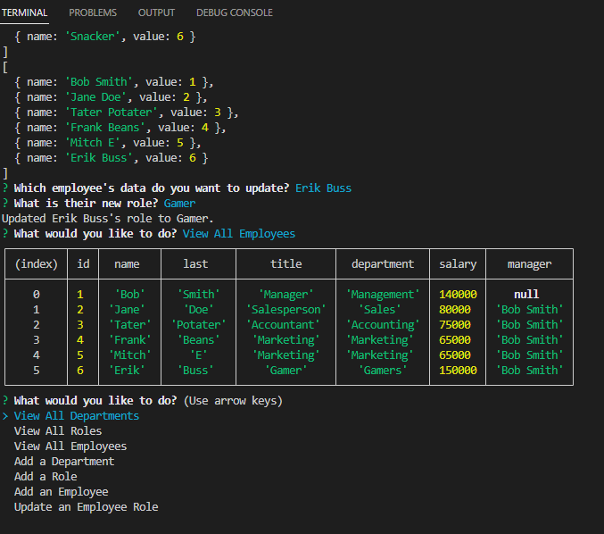

# Employee Tracker

## Table of Contents
* [Description](#description)
* [Installation](#installation)
* [Usage](#usage)
* [License](#license)
* [Contributing](#contributing)
* [Tests](#tests)
* [Questions](#questions)

## Description 
The Employee Tracker is a back-end app that stores a company's employee information and allows the user to view department, role, and employee information. The user can also add departments, roles, and employees, as well as update employee information.

## Installation 
npm i, uses inquirer and mysql2.

## Usage 
N/A

## License 
This project is licensed under the MIT License

## Contributing 
N/A

## Tests 
N/A

## Questions 
My GitHub username is neft-tk, and you can see more of my work at https://github.com/neft-tk 
You can also reach me at ebussman@gmail.com

